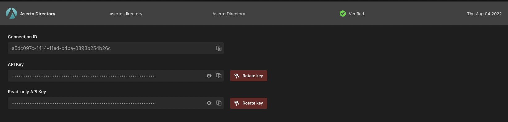

# java-directory examples
[](https://asertocommunity.slack.com)


## 0. prerequisites 

Ensure you are in the `examples` directory

```
cd examples
```

## 1. building the examples

To build the example package, execute:

```
mvn clean && mvn package
```

## 2. setup environment

### Using [topaz](https://topaz.sh)

### 2.1 copy the `examples/assets/.env.topaz-directory.example` to the examples directory

```bash
cp assets/.env.topaz-directory.example .env
```

### 2.2 update settings in the `examples/.env` file


When connecting to a **local** topaz directory instance, **no** additional configuration is required, the copied configuration file contains the all correct (default) values required to connect!

`examples/.env`

```
# topaz directory settings for the java-directory-example.
#
# copy this file to the examples directory with filename .env (examples/.env)
# 
# NOTE for a local topaz setup, these values do not need to be changed.
ASERTO_DIRECTORY_HOST=localhost
ASERTO_DIRECTORY_PORT=9292

# NOTE for a topaz setup, the ASERTO_DIRECTORY_KEY and ASERTO_TENANT_ID settings are not used.
#
# ASERTO_DIRECTORY_KEY=""
# ASERTO_TENANT_ID=""
```

When connecting to a **remote** topaz directory instance, you must update the `host` and `port` information in the `.env` file.

`examples/.env`

```
ASERTO_DIRECTORY_HOST=<my.remote.topaz-directory>
ASERTO_DIRECTORY_PORT=<port>
```

### Using the hosted [aserto](https://console.aserto.com) directory 

### 2.3 copy the `examples/assets/.env.hosted-directory.example` to the examples directory

```bash
cp assets/.env.hosted-directory.example .env
```

### 2.4 update settings in the `examples/.env` file


When connecting to the **hosted** directory, you must update the `.env` file with the following configuration values.


```
# hosted directory settings for the java-directory-example.
#
# copy this file to the examples directory with filename .env (examples/.env)
#
# NOTE for a hosted setup, these values do not need to be changed.
ASERTO_DIRECTORY_HOST=directory.prod.aserto.com
ASERTO_DIRECTORY_PORT=8443

# NOTE: directory key can be retrieved from the "Aserto Directory" entity in the connections panel in the Aserto console, see https://console.aserto.com/ui/connections.
# There are two API keys list, one for read-only access (name Read-only API Key) and one for read-write access (named API Key). 
# For the example you need the read-write key.
ASERTO_DIRECTORY_KEY=""

# NOTE: tenant id can be retrieved from the "Manage Organization" section in the Aserto console, see https://console.aserto.com/ui/manage-tenant?selected=SETTINGS.
ASERTO_TENANT_ID=""
```

The require information can be located in the [aserto console](https://console.aserto.com/): 

* Tenant ID in the [Manage Organization](https://console.aserto.com/ui/manage-tenant?selected=SETTINGS) section.
* Directory API key in the [Connections](https://console.aserto.com/ui/connections) section by expanding the `Aserto Directory` panel.



This allows you to copy your read-only or read-write API key, depending on your needs.


## 3. Running the example

To run the examples:

```bash
java -jar target/examples-1.0.0-SNAPSHOT-shaded.jar
```

The output contains the instance information the example is connected to.

```
❯ java -jar examples/target/examples-1.0.0-SNAPSHOT-shaded.jar
Connecting to directory: localhost:9292...
...
```
